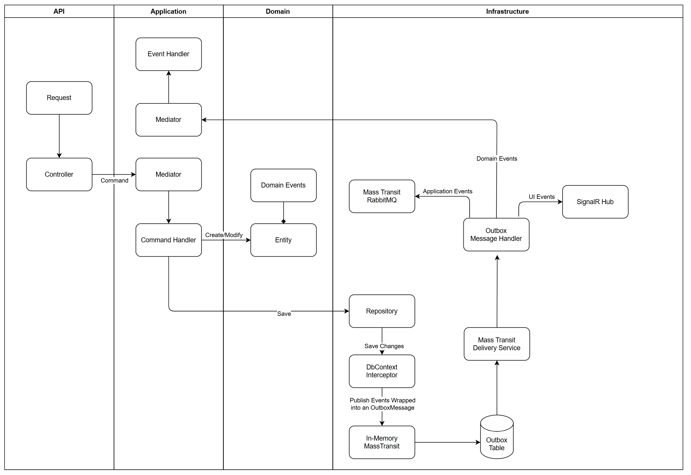

# Outbox Pattern Example

This project demonstrates the implementation of the Outbox Pattern using **MassTransit**, **EF Core**, **MediatR**, and **SignalR** within a Clean Architecture structure. The Outbox Pattern ensures data consistency across distributed systems by persisting events in an outbox table and processing them asynchronously.

## Project Structure

The project is organized according to the principles of Clean Architecture, with a clear separation of responsibilities:

- **Api**: Exposes HTTP endpoints for the application.
- **Application Layer**: Contains business logic, commands, event handlers, and services.
- **Domain Layer**: Defines core entities, domain events, and business rules.
- **Infrastructure Layer**: Implements data persistence, event publishing, and external service integration.

## Key Concepts and Technologies

### Outbox Pattern
The Outbox Pattern ensures that events are published only when the database transaction is successful. Events are stored in an outbox table and processed asynchronously to maintain consistency.

### MassTransit
MassTransit is used to handle message publishing and consumption. The project has two configurations:
1. **In-Memory Configuration**: Consumes messages from the outbox table and routes them based on their type.
2. **RabbitMQ Configuration**: Publishes application events to RabbitMQ for external distribution.

### EF Core
EF Core is used for data persistence and integrates with MassTransit to handle outbox messages automatically.

### MediatR
MediatR is used to process domain events internally within the application.

### SignalR
SignalR is used to send UI events in real time to connected clients.

## Setup and Configuration

### Prerequisites
- [.NET 8](https://dotnet.microsoft.com/download/dotnet/8.0)
- [RabbitMQ](https://www.rabbitmq.com/download.html)
- SQL Server

### Architecture Diagram

